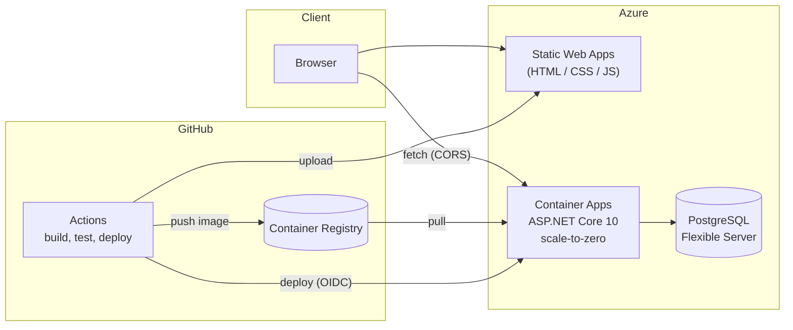

# OmniArchivum

[](https://github.com/willdevstuff/OmniArchivum-API/actions/workflows/ci.yml)

**A full-stack technical knowledge archive** — an ASP.NET Core 10 REST API with PostgreSQL
full-text search, and a framework-free HTML/CSS/JavaScript client, deployed to Azure with
automated CI/CD.

### 🔗 Live

| | |
|---|---|
| **App** | https://mango-ground-058108a0f.7.azurestaticapps.net |
| **API** | https://omniarchivum-api.proudmoss-5344fb15.uksouth.azurecontainerapps.io/api/notes |
| **Interactive API docs** | https://omniarchivum-api.proudmoss-5344fb15.uksouth.azurecontainerapps.io/scalar/v1 |

> **Every visitor gets their own private copy of the archive.** Create, edit and delete
> whatever you like — nobody else sees it, and you're not editing anyone else's. Guest
> data is reclaimed automatically after a couple of days.

> The API runs on Azure Container Apps with **scale-to-zero**, so the first request after an
> idle period spends 20–30 seconds starting a container before responding. The frontend
> shows a loading state and explains this rather than appearing to hang. Everything after
> that first request is fast. This is a deliberate trade to keep hosting costs at zero.

It's designed to store and query technical knowledge — game development setups, programming
solutions, music production chains, workflow notes — using rich search and flexible tagging.

---

## Features

### Core Architecture

- ASP.NET Core Web API (.NET 10)
- Layered architecture (Controllers → Services → Data)
- PostgreSQL 16
- Entity Framework Core (Npgsql)
- OpenAPI + Scalar interactive documentation
- EF Core migrations for schema evolution

### Data Model

- `Note` entities with Markdown content
- `Tag` entities (many-to-many with notes, with optional categories)
- Soft delete via global query filter
- Full-text search using PostgreSQL `tsvector` + GIN index

### Session Isolation

- Every visitor gets a sandboxed archive of their own, seeded with the demo content
- One `OwnerKey` column and one EF Core global query filter scope every read and write —
  guest sessions and the signed-in owner are the same code path
- Ownership is derived from a signed bearer token, so a caller can't name another
  session; endpoints return `401` without one rather than an empty archive
- A background job reclaims guest data after two days
- Writes are additionally rate-limited per IP; reads never are

### Search & Filtering

- Full-text search endpoint  
  `/api/notes/search?q=<query>`

- Multi-tag AND filtering  
  `/api/notes?tag=unity&tag=fmod`

### Frontend

- Plain HTML, CSS, and vanilla JavaScript — no framework, no build step, no dependencies
- Lists, searches, and paginates notes
- Filters by tag, with tags grouped and colour-coded by category
- Full CRUD: create, edit and delete notes; link/unlink tags; delete tags outright
- Renders note bodies as Markdown, with a discoverable formatting-help panel in the editor
- Talks to the API directly via `fetch`

### Testing

- Unit tests for the service layer against SQLite in-memory (fast, no Docker required)
- Integration tests against a real, disposable PostgreSQL container (Testcontainers) — covers
  full-text search behaviour that no in-memory provider can reproduce
- HTTP-level tests via `WebApplicationFactory` exercising the real routing/DI pipeline

---

## Tech Stack

| Layer        | Technology                                                    |
|--------------|---------------------------------------------------------------|
| Runtime      | .NET 10 (ASP.NET Core Web API)                                |
| Frontend     | HTML, CSS, vanilla JavaScript                                 |
| Database     | PostgreSQL 16                                                 |
| ORM          | Entity Framework Core (Npgsql)                                |
| Search       | PostgreSQL `tsvector` + GIN index                             |
| API Docs     | OpenAPI + Scalar                                              |
| Testing      | xUnit, SQLite (unit), Testcontainers + Postgres (integration) |
| Hosting      | Azure Container Apps, Azure Static Web Apps, Azure PostgreSQL |
| CI/CD        | GitHub Actions, GitHub Container Registry, Azure OIDC         |
| Tooling      | Docker, PowerShell dev helpers                                |

---

## Deployed Architecture



Every push to `main` runs the full test suite, and only on success builds the API image,
pushes it to GitHub Container Registry, and deploys both the API and the frontend.

A few deliberate choices worth calling out:

- **Scale-to-zero over always-on.** Container Apps' consumption plan has a permanent monthly
  free grant; keeping a replica always warm would exceed it. The cost is a cold start, which
  the frontend handles explicitly rather than hiding.
- **GitHub Container Registry, not Azure Container Registry.** ACR has no meaningful free
  tier; GHCR is free for public repositories and Container Apps can pull from either.
- **OIDC federated credentials, not a stored publish profile.** The deploy job exchanges a
  short-lived GitHub token for an Azure one. There is no secret in the repository that grants
  access to the subscription — only a trust relationship scoped to this repo's `main` branch.
- **Migrations run at application startup**, so both a fresh clone and a fresh deploy against
  an empty database work with no manual step.

---

## Getting Started

### Requirements

- .NET 10 SDK
- Docker Desktop
- PowerShell (optional, for dev tooling)

### 1. Clone the repository

```bash
git clone https://github.com/willdevstuff/OmniArchivum-API.git
cd OmniArchivum-API
```

### 2. Start PostgreSQL

```bash
docker compose up -d
```

### 3. Run the API

```bash
cd OmniArchivum.Api
dotnet run
```

The API applies EF Core migrations on startup, and seeds a small set of demo notes if the
database is empty — so there's something to look at immediately.

### 4. Open the API documentation

http://localhost:5000/scalar/v1

### 5. Run the frontend

The frontend is static HTML/CSS/JS with no build step, but it uses ES modules, which browsers
won't load over `file://`. Serve it with any static file server while the API is running:

```bash
cd frontend
python -m http.server 8080
```

Then open http://localhost:8080. It detects localhost and talks to `http://localhost:5000`,
falling back to the deployed API otherwise (see `API_BASE` in `frontend/js/api.js`).

### 6. Run the tests

```bash
dotnet test
```

Requires Docker Desktop running — the integration tests spin up a real, disposable PostgreSQL
container via Testcontainers. That's deliberate: full-text search relies on `tsvector`/GIN
behaviour specific to Postgres, which can't be validated against an in-memory or SQLite
substitute. Everything else runs against SQLite in-memory, so most of the suite is fast and
never touches Docker.

---

## Example Usage

### Create a note

```powershell
Invoke-RestMethod -Method POST `
  -Uri "http://localhost:5000/api/Notes" `
  -ContentType "application/json" `
  -Body '{"title":"Test Note","bodyMarkdown":"Test information."}'
```

### Search notes

```powershell
Invoke-RestMethod -Method GET `
  -Uri "http://localhost:5000/api/Notes/search?q=test"
```

### Filter by tags (AND logic)

```powershell
Invoke-RestMethod -Method GET `
  -Uri "http://localhost:5000/api/Notes?tag=programming&tag=csharp"
```

---

## Developer Tooling

Optional PowerShell helper functions live in `Scripts/dev-tools.ps1`. Load them with:

```powershell
. .\Scripts\dev-tools.ps1
```

| Command          | Description                              | Example                                     |
| ---------------- | ---------------------------------------- | ------------------------------------------- |
| `oa-note-new`    | Create a new note                        | `oa-note-new "Test Note" "Test info"`       |
| `oa-notes`       | List all notes                           | `oa-notes`                                  |
| `oa-tag-new`     | Create a tag (name + optional category)  | `oa-tag-new "csharp" "language"`            |
| `oa-tags`        | List all tags                            | `oa-tags`                                   |
| `oa-tag-link`    | Link a tag to a note                     | `oa-tag-link <TAG_ID> <NOTE_ID>`            |
| `oa-notes-bytag` | Filter notes by tag(s), AND logic        | `oa-notes-bytag programming csharp`         |
| `oa-search`      | Full-text search                         | `oa-search "test"`                          |

---

## Key Design Decisions

- Separation of concerns via layered architecture (Controllers → Services → Data)
- Soft delete implemented with EF Core global query filters, so deleted rows are excluded
  model-wide rather than by a `Where` clause repeated at each call site
- Full-text search using PostgreSQL `tsvector` + GIN indexing, as a generated column that
  stays in sync with no trigger to maintain
- Multi-tag AND filtering using repeated query parameters
- The `DbContext` is provider-aware: Postgres-specific features are configured only when
  running on Npgsql, so the same model can back fast SQLite-based unit tests
- The Markdown renderer escapes HTML *before* applying any transform, so user-supplied note
  bodies on the public demo cannot inject markup
- Per-session isolation is a single `OwnerKey` column rather than a database per visitor:
  creating a database per session would mean running migrations and holding a connection
  pool per visitor, which doesn't scale and buys nothing over a query filter
- `SaveChanges` stamps the owner on insert, so a future write path can't create unowned —
  and therefore invisible — rows by forgetting to set it
- Sessions use bearer tokens rather than cookies because the frontend and API are on
  different sites: a cookie there would be a third-party cookie, which Safari blocks
  outright and Chrome is phasing out

---

## Planned Enhancements

- Note revision history
- Tag negation filtering
- Hierarchical categories
- Authentication and user support

---

## Configuration

Local development connection strings are excluded from source control via `.gitignore`.
